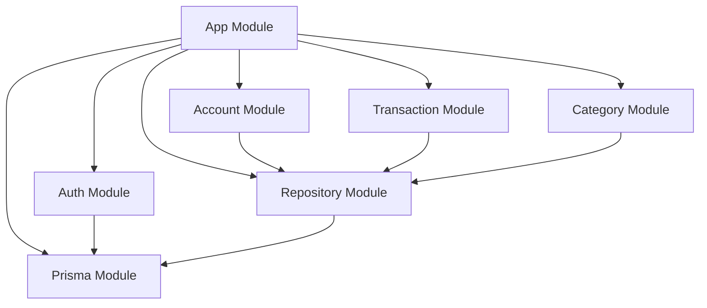

# Architecture Documentation

## Overview

This personal finance API follows a **Clean Architecture** approach with **Domain-Driven Design (DDD)** principles, implemented using NestJS framework. The architecture prioritizes maintainability, testability, and separation of concerns.

## Architectural Principles

### 1. Separation of Concerns
- Each module handles a specific domain (auth, accounts, transactions, categories)
- Clear boundaries between business logic, data access, and presentation layers
- Dependencies flow inward toward the domain core

### 2. Dependency Inversion
- High-level modules don't depend on low-level modules
- Both depend on abstractions (interfaces)
- Repository pattern abstracts data access layer

### 3. Single Responsibility
- Each class/module has one reason to change
- Controllers handle HTTP requests only
- Services contain business logic
- Repositories handle data persistence

## Layer Structure

```
┌─────────────────────────────────────┐
│           Presentation Layer        │
│         (Controllers, DTOs)         │
├─────────────────────────────────────┤
│          Application Layer          │
│        (Services, Use Cases)        │
├─────────────────────────────────────┤
│            Domain Layer             │
│        (Entities, Interfaces)       │
├─────────────────────────────────────┤
│         Infrastructure Layer        │
│    (Repositories, Database, Auth)   │
└─────────────────────────────────────┘
```

### Presentation Layer (`src/*/controllers/`)
- **Responsibility**: Handle HTTP requests/responses, validation, serialization
- **Components**: Controllers, DTOs, Guards, Filters
- **Dependencies**: Application Layer services

### Application Layer (`src/*/services/`)
- **Responsibility**: Business logic, use cases, orchestration
- **Components**: Services, Use Cases
- **Dependencies**: Domain interfaces, Repository interfaces

### Domain Layer (`src/entities/`, `src/repositories/interfaces/`)
- **Responsibility**: Core business rules, entities, domain interfaces
- **Components**: Entities, Repository interfaces, Types
- **Dependencies**: None (pure business logic)

### Infrastructure Layer (`src/repositories/implementations/`, `src/prisma/`)
- **Responsibility**: Data persistence, external services, technical details
- **Components**: Repository implementations, Database configuration, External APIs
- **Dependencies**: Domain interfaces

## Module Organization

Each business domain follows this structure:

```
src/[domain]/
├── [domain].controller.ts    # HTTP endpoints
├── [domain].service.ts       # Business logic
├── [domain].module.ts        # NestJS module configuration
└── dto/
    └── [domain].dto.ts       # Data transfer objects
```

Supporting infrastructure:

```
src/
├── entities/                 # Domain entities
├── repositories/
│   ├── interfaces/           # Repository contracts
│   ├── implementations/      # Concrete implementations
│   └── types/               # Repository-specific types
├── common/                   # Shared utilities
├── config/                   # Configuration files
└── prisma/                   # Database service
```

## Design Patterns

### 1. Repository Pattern
- Abstracts data access logic
- Enables easy testing with mock repositories
- Provides consistent interface for data operations
- See [Repository Pattern Documentation](./REPOSITORY_PATTERN.md)

### 2. Dependency Injection
- NestJS IoC container manages dependencies
- Constructor injection for services and repositories
- Enables easy testing and loose coupling

### 3. DTO Pattern
- Separate objects for data transfer
- Input validation and transformation
- Decouples external contracts from internal models

### 4. Guard Pattern
- Authentication and authorization logic
- Reusable across multiple endpoints
- Centralized security concerns

## Module Dependencies



## Data Flow

### Typical Request Flow:
1. **Client Request** → Controller (Presentation)
2. **Controller** → Service (Application)
3. **Service** → Repository Interface (Domain)
4. **Repository Implementation** → Database (Infrastructure)
5. **Response** flows back through the same layers

### Example: Get User Accounts
```typescript
Client Request
    ↓
AccountController.getAccounts()
    ↓
AccountService.getAccountsByUserId()
    ↓
IAccountRepository.findByUserId()
    ↓
PrismaAccountRepository.findByUserId()
    ↓
Prisma Client → PostgreSQL
```

## Error Handling Strategy

### 1. Domain Errors
- Business rule violations throw domain-specific exceptions
- Services catch and transform to appropriate HTTP responses

### 2. Infrastructure Errors
- Database connection issues, external API failures
- Repository layer handles and throws standardized errors

### 3. Validation Errors
- DTO validation at controller level
- Class-validator decorators provide automatic validation

### 4. Global Exception Filter
- Centralized error handling and logging
- Consistent error response format
- Security: Don't expose internal errors in production

## Security Architecture

### 1. Authentication
- JWT-based stateless authentication
- Passport.js strategies for flexible auth methods
- Secure password hashing with bcrypt

### 2. Authorization
- Role-based access control (future enhancement)
- Resource-level permissions (users can only access their data)
- Guard-based protection at endpoint level

### 3. Data Protection
- Input sanitization and validation
- SQL injection prevention (Prisma ORM)
- Environment variable protection

## Testing Strategy

### 1. Unit Tests
- Service layer business logic
- Repository implementations
- Utility functions

### 2. Integration Tests
- Controller → Service → Repository flow
- Database operations
- Authentication flows

### 3. End-to-End Tests
- Complete user workflows
- API contract validation
- Cross-module interactions

## Performance Considerations

### 1. Database
- Proper indexing on frequently queried fields
- Connection pooling via Prisma
- Query optimization and monitoring

### 2. Caching Strategy
- JWT token validation caching
- Frequently accessed data caching (future enhancement)
- Response caching for read-heavy operations

### 3. API Design
- Pagination for large datasets
- Selective field loading
- Efficient query patterns

## Future Architecture Enhancements

### 1. Event-Driven Architecture
- Domain events for complex business workflows
- Eventual consistency for distributed operations
- Audit trail and event sourcing

### 2. CQRS (Command Query Responsibility Segregation)
- Separate read and write models
- Optimized query patterns
- Better scalability for complex domains

### 3. Microservices Transition
- Service decomposition along domain boundaries
- API Gateway pattern
- Distributed data management

## Development Guidelines

### 1. Adding New Features
1. Start with domain modeling (entities, interfaces)
2. Implement repository interface
3. Create service with business logic
4. Add controller for HTTP endpoints
5. Write comprehensive tests

### 2. Modifying Existing Features
1. Check impact on dependent modules
2. Update tests first (TDD approach)
3. Maintain backward compatibility where possible
4. Update documentation

### 3. Code Quality Standards
- Follow TypeScript strict mode
- Use ESLint and Prettier configurations
- Maintain test coverage above 80%
- Document complex business logic

## Monitoring and Observability

### 1. Logging Strategy
- Structured logging with context
- Different log levels for different environments
- Centralized log aggregation (future)

### 2. Metrics Collection
- API response times and error rates
- Database query performance
- Business metrics (transactions, accounts created)

### 3. Health Checks
- Database connectivity
- External service dependencies
- Application health endpoints

---

This architecture serves as the foundation for scalable, maintainable personal finance management system. All new development should align with these principles and patterns.